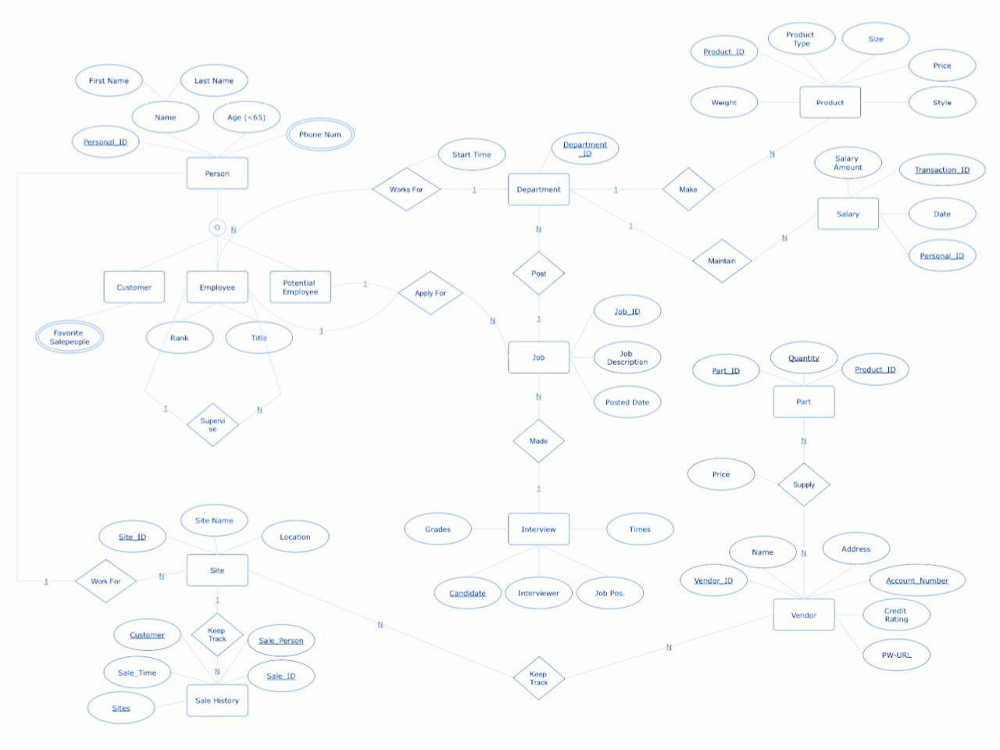
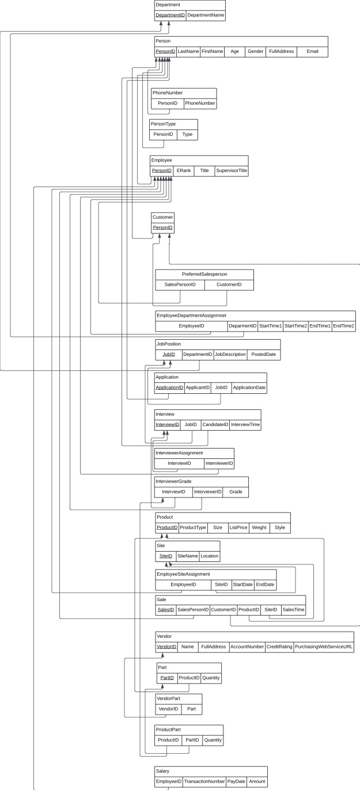
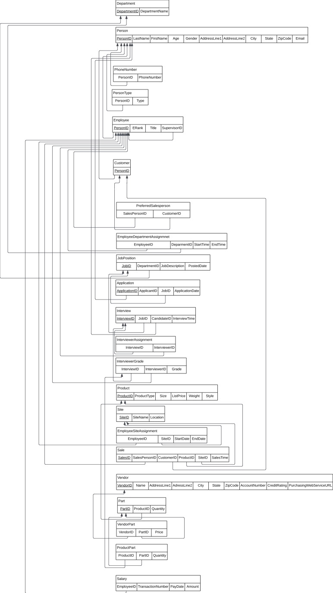
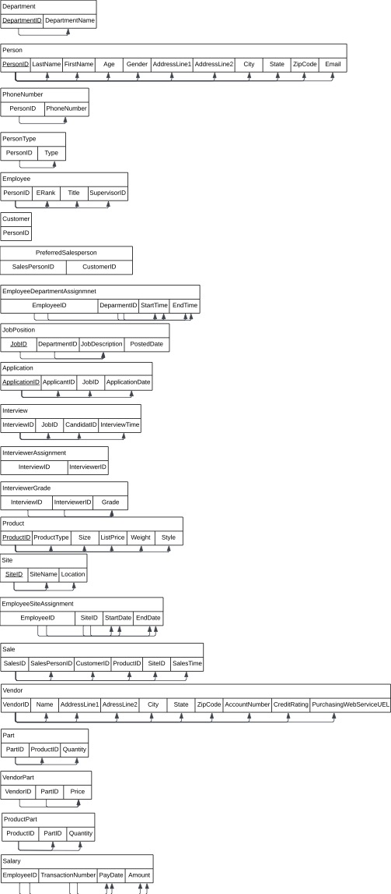

# XYZ Company Database Viewer

A web-based interface for viewing and querying the XYZ Company database.

## Project Questions & Answers

### Additional Business Rules
1. **Employee Department Assignment Rule**: An employee can only be assigned to one department at a time, with start and end dates tracked for historical purposes.
2. **Salary Validation Rule**: Employee salaries must be within a predefined range based on their rank and department.
3. **Interview Scheduling Rule**: Interviews must be scheduled at least 24 hours in advance and cannot overlap for the same interviewer.
4. **Product Price Rule**: Product list prices must be at least 20% higher than the total cost of their parts.
5. **Vendor Credit Rating Rule**: Vendors with a credit rating below 5 cannot supply parts for products with a list price above $500.

### Super-class/Subclass Relationships
Yes, super-class/subclass relationships are important in this environment for several reasons:
1. **Person Entity**: The system has three types of people (employees, customers, potential employees) who share common attributes but have specific attributes and relationships.
2. **Data Integrity**: This structure ensures that all person types maintain consistent basic information while allowing for type-specific data.
3. **Flexibility**: The design allows a person to belong to multiple categories (e.g., an employee can also be a customer).
4. **Maintainability**: Common attributes are stored in one place, reducing redundancy and potential inconsistencies.

### Relational DBMS Justification
Using a Relational DBMS like Oracle is justified for this project because:
1. **Data Integrity**: The system requires strong referential integrity for relationships between entities.
2. **Transaction Support**: Critical operations like sales and salary payments need ACID compliance.
3. **Scalability**: The company's data will grow over time, and a relational DBMS can handle this growth efficiently.
4. **Query Capability**: Complex queries across multiple tables are common in this system.
5. **Security**: Oracle provides robust security features for sensitive employee and financial data.

## Project Deliverables

### ER & EER Diagrams


### Relational Schema
#### Pre-Normalization


#### 3NF Normalized Schema


### Dependency Diagram


## Prerequisites

- Python 3.7 or higher
- MySQL Server
- The XYZ Company database must be created and populated with data

## Setup

### Backend Setup (Python/Flask)

1. Clone this repository:
```bash
git clone <repository-url>
cd xyz-company-database
```

2. Create a virtual environment and activate it:
```bash
python -m venv venv
source venv/bin/activate  # On Windows: venv\Scripts\activate
```

3. Install the required packages:
```bash
pip install -r requirements.txt
```

4. Make sure your MySQL server is running and the XYZ Company database is created.

### Frontend Setup (Next.js)

1. Navigate to the frontend directory:
```bash
cd frontend
```

2. Install dependencies:
```bash
npm install
```

3. Create a `.env.local` file in the frontend directory with the following content:
```
NEXT_PUBLIC_API_URL=http://localhost:5000
```

4. Start the development server:
```bash
npm run dev
```

The frontend will be available at `http://localhost:3000`

## Running the Application

1. Start the Flask backend:
```bash
# From the root directory
python app.py
```

2. Start the Next.js frontend (in a separate terminal):
```bash
# From the frontend directory
cd frontend
npm run dev
```

3. Open your web browser and navigate to:
```
http://localhost:3000
```

4. Connect to your database using the following default values:
   - Host: localhost
   - Port: 3306
   - User: root
   - Password: (your MySQL password)
   - Database: xyz_company

## Development

### Backend Development
- The Flask backend runs on port 5000
- API endpoints are defined in `backend/app.py`
- Database schema is defined in `DDL.sql`
- Test data can be generated using `backend/generate_data.py`

### Frontend Development
- The Next.js frontend runs on port 3000
- Main page component is in `frontend/src/app/page.tsx`
- API routes are in `frontend/src/app/api/`
- Styling uses Tailwind CSS
- TypeScript is used for type safety

## Features

- View all database tables
- Execute predefined queries
- Display query results in a formatted table
- Connect/disconnect from the database

## Query List

The application includes the following predefined queries:

1. **Interviewers for Hellen Cole (Job 11111)**
```sql
SELECT DISTINCT i.InterviewerID, p.LastName, p.FirstName 
FROM InterviewerAssignment i 
JOIN Interview iv ON i.InterviewID = iv.InterviewID 
JOIN JobPosition jp ON iv.JobID = jp.JobID 
JOIN Person p ON i.InterviewerID = p.PersonID 
WHERE iv.CandidateID = (SELECT PersonID FROM Person WHERE FirstName = 'Hellen' AND LastName = 'Cole') 
AND jp.JobID = 11111;
```

2. **Jobs posted by Marketing (January 2011)**
```sql
SELECT j.JobID 
FROM JobPosition j 
JOIN Department d ON j.DepartmentID = d.Department_ID 
WHERE d.DepartmentName = 'Marketing' 
AND j.PostedDate >= '2011-01-01' 
AND j.PostedDate < '2011-02-01';
```

3. **Employees with no supervisees**
```sql
SELECT e.PersonID, CONCAT(p.FirstName, ' ', p.LastName) AS Name 
FROM Employee e 
JOIN Person p ON e.PersonID = p.PersonID 
WHERE e.PersonID NOT IN (
    SELECT SupervisorID 
    FROM Employee 
    WHERE SupervisorID IS NOT NULL
);
```

4. **Marketing sites with no sales (March 2011)**
```sql
SELECT s.SiteID, s.Location 
FROM Site s 
JOIN Department d ON d.DepartmentName = 'Marketing' 
WHERE s.SiteID NOT IN (
    SELECT SiteID 
    FROM Sale 
    WHERE SalesTime BETWEEN '2011-03-01' AND '2011-03-31'
);
```

5. **Jobs with no hires after 1 month of posting**
```sql
SELECT jp.JobID, jp.JobDescription 
FROM JobPosition jp 
WHERE NOT EXISTS (
    SELECT 1 
    FROM Application a 
    WHERE a.JobID = jp.JobID 
    AND a.ApplicationDate <= DATE_ADD(jp.PostedDate, INTERVAL 1 MONTH)
    AND a.Status = 'Selected'
);
```

6. **Salespeople who sold all products > $200**
```sql
SELECT sp.PersonID, CONCAT(p.FirstName, ' ', p.LastName) AS Name 
FROM Employee sp 
JOIN Person p ON sp.PersonID = p.PersonID 
WHERE NOT EXISTS (
    SELECT pt.ProductType 
    FROM Product pt 
    WHERE pt.ListPrice > 200 
    AND pt.ProductType NOT IN (
        SELECT DISTINCT pr.ProductType 
        FROM Sale s 
        JOIN Product pr ON s.ProductID = pr.ProductID 
        WHERE s.SalesPersonID = sp.PersonID
    )
);
```

7. **Departments with no job posts (Jan-Feb 2011)**
```sql
SELECT d.Department_ID, d.DepartmentName 
FROM Department d 
WHERE d.Department_ID NOT IN (
    SELECT jp.DepartmentID 
    FROM JobPosition jp 
    WHERE jp.PostedDate BETWEEN '2011-01-01' AND '2011-02-28'
);
```

8. **Employees applying for job 12345**
```sql
SELECT e.PersonID AS EmployeeID, CONCAT(p.FirstName, ' ', p.LastName) AS Name, ed.DepartmentID 
FROM Employee e 
JOIN Person p ON e.PersonID = p.PersonID 
JOIN Application a ON e.PersonID = a.ApplicantID 
JOIN JobPosition jp ON a.JobID = jp.JobID 
LEFT JOIN EmployeeDepartmentAssignment ed ON e.PersonID = ed.EmployeeID 
WHERE jp.JobID = 12345;
```

9. **Best seller's type**
```sql
SELECT pt.Type AS EmployeeType, COUNT(*) AS TotalSales 
FROM Sale s 
JOIN Employee e ON s.SalesPersonID = e.PersonID 
JOIN PersonType pt ON e.PersonID = pt.PersonID 
WHERE pt.Type = 'Employee' 
GROUP BY pt.Type 
ORDER BY TotalSales DESC 
LIMIT 1;
```

10. **Product type with highest net profit**
```sql
SELECT pr.ProductType 
FROM Product pr 
JOIN ProductPart pp ON pr.ProductID = pp.ProductID 
JOIN VendorPart vp ON pp.PartID = vp.PartID 
GROUP BY pr.ProductType 
ORDER BY (SUM(pr.ListPrice) - SUM(vp.Price)) DESC 
LIMIT 1;
```

11. **Employees working in all departments**
```sql
SELECT e.EmployeeID AS PersonID, p.LastName, p.FirstName 
FROM EmployeeDepartmentAssignment e 
JOIN Person p ON e.EmployeeID = p.PersonID 
GROUP BY e.EmployeeID, p.LastName, p.FirstName 
HAVING COUNT(DISTINCT e.DepartmentID) = (SELECT COUNT(*) FROM Department);
```

12. **Interviewees selected (name and email)**
```sql
SELECT CONCAT(p.FirstName, ' ', p.LastName) AS IntervieweeName, p.Email AS EmailAddress 
FROM Interview i 
JOIN Person p ON i.CandidateID = p.PersonID 
WHERE EXISTS (
    SELECT 1 
    FROM InterviewGrade ig 
    WHERE ig.InterviewID = i.InterviewID 
    AND ig.Grade >= 70
    GROUP BY ig.InterviewID
    HAVING COUNT(DISTINCT ig.RoundNumber) >= 5
);
```

13. **Interviewees (name, phone, email)**
```sql
SELECT p.FirstName, p.LastName, ph.PhoneNumber, p.Email
FROM Person p 
JOIN PhoneNumber ph ON p.PersonID = ph.PersonID 
JOIN Interview i ON p.PersonID = i.CandidateID
WHERE EXISTS (
    SELECT 1 
    FROM InterviewGrade ig 
    WHERE ig.InterviewID = i.InterviewID 
    AND ig.Grade >= 70
    GROUP BY ig.InterviewID
    HAVING COUNT(DISTINCT ig.RoundNumber) >= 5
);
```

14. **Employee with highest average salary**
```sql
SELECT p.PersonID, p.FirstName, p.LastName 
FROM Person p 
JOIN Salary s ON p.PersonID = s.EmployeeID 
GROUP BY s.EmployeeID 
ORDER BY AVG(s.Amount) DESC 
LIMIT 1;
```

15. **Vendor supplying 'Cup' (lowest price)**
```sql
SELECT v.VendorID, v.Name AS VendorName 
FROM Vendor v 
JOIN VendorPart vp ON v.VendorID = vp.VendorID 
JOIN Part p ON vp.PartID = p.PartID 
WHERE p.PartName = 'Cup' 
AND p.Weight < 4 
AND vp.Price = (
    SELECT MIN(vp2.Price) 
    FROM VendorPart vp2 
    JOIN Part p2 ON vp2.PartID = p2.PartID 
    WHERE p2.PartName = 'Cup' 
    AND p2.Weight < 4
);
```

### Database Views

1. **Employee Average Monthly Salaries**
```sql
CREATE VIEW EmployeeAverageSalary AS
SELECT 
    e.PersonID,
    CONCAT(p.FirstName, ' ', p.LastName) AS EmployeeName,
    AVG(s.Amount) AS AverageMonthlySalary
FROM Employee e
JOIN Person p ON e.PersonID = p.PersonID
JOIN Salary s ON e.PersonID = s.EmployeeID
GROUP BY e.PersonID, p.FirstName, p.LastName;
```

2. **Interview Rounds Passed**
```sql
CREATE VIEW InterviewRoundsPassed AS
SELECT 
    i.CandidateID,
    CONCAT(p.FirstName, ' ', p.LastName) AS CandidateName,
    i.JobID,
    jp.JobDescription,
    COUNT(DISTINCT ig.RoundNumber) AS PassedRounds
FROM Interview i
JOIN Person p ON i.CandidateID = p.PersonID
JOIN JobPosition jp ON i.JobID = jp.JobID
JOIN InterviewGrade ig ON i.InterviewID = ig.InterviewID
WHERE ig.Grade >= 60
GROUP BY i.CandidateID, p.FirstName, p.LastName, i.JobID, jp.JobDescription;
```

3. **Product Type Sales**
```sql
CREATE VIEW ProductTypeSales AS
SELECT 
    p.ProductType,
    COUNT(s.SalesID) AS TotalItemsSold,
    SUM(s.Amount) AS TotalSalesAmount
FROM Product p
LEFT JOIN Sale s ON p.ProductID = s.ProductID
GROUP BY p.ProductType;
```

4. **Product Part Costs**
```sql
CREATE VIEW ProductPartCost AS
SELECT 
    p.ProductID,
    p.ProductType,
    SUM(pp.Quantity * vp.Price) AS TotalPartCost
FROM Product p
JOIN ProductPart pp ON p.ProductID = pp.ProductID
JOIN VendorPart vp ON pp.PartID = vp.PartID
GROUP BY p.ProductID, p.ProductType;
```

## Security Notes

- This application is designed for local development only
- The secret key in app.py should be changed in production
- Database credentials are stored in the session and not persisted